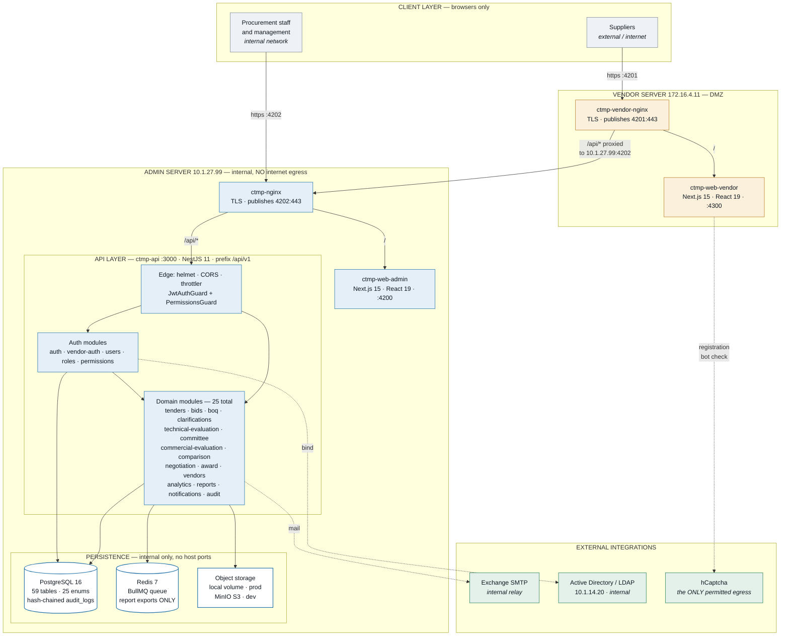
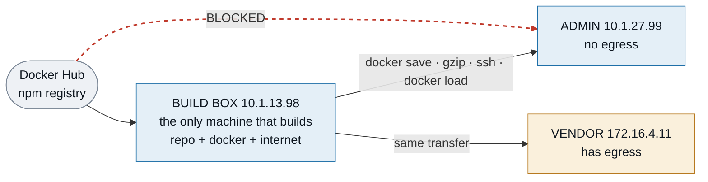

# CTMP — Architecture

**Corporate Tender Management Platform** — an on-premises procurement system for HadiClinic: staff
raise and evaluate tenders in an internal admin portal, external suppliers bid through a separate
public vendor portal, and every sensitive action is written to a hash-chained audit trail.

Audited 2026-08-21 against the working tree and the running containers; refreshed the same day
after the production deploy of migrations `054`/`055` and two Arabic fixes.

---

## Platform scope — read this before looking for mobile code

**There is no iOS app, no Android app, and no mobile codebase in this repository.** This was
verified, not assumed: the tree contains no `*.xcodeproj`, `Podfile`, `build.gradle`,
`AndroidManifest.xml`, `pubspec.yaml`, `*.swift` or `*.kt`, and neither React Native, Capacitor,
Expo nor Flutter appears in any `package.json`.

CTMP is delivered as **three web applications** (one API, two browser front-ends). Both portals are
responsive and usable from a phone browser, but nothing is packaged, signed or shipped to an app
store. If native apps are wanted, that is greenfield work — there is no existing mobile layer to
extend, and none of the current auth (cookie/JWT via a same-origin nginx) is designed for a native
client yet.

---

## System diagram



**Reading it:** blue is the internal admin server, amber the DMZ vendor server, white cylinders the
data stores, green the external services. Each browser talks to exactly one origin — nginx serves
the UI at `/` and routes `/api/*` onward, so there is no cross-origin traffic in the normal path.

Note what the diagram does **not** contain: no mobile clients, no payment gateway, no push service,
no service mesh. Those were checked for and are absent — see § Platform scope above and the module
list below for what is actually there. Redis in particular is **not a cache**: it is wired solely to
the BullMQ queue behind async report exports.

## The stack

| Layer | Technology | Version | Notes |
|---|---|---|---|
| Runtime | Node.js | 20 (alpine base images) | |
| Language | TypeScript | 5.x | strict; every app |
| Package manager | pnpm | 10.15.0 | workspace monorepo, `--frozen-lockfile` in builds |
| **Backend** | NestJS | 11 | modular; 25 feature modules |
| ORM | Prisma | 6 | `apps/api/prisma/schema.prisma` |
| Database | PostgreSQL | 16-alpine | 59 tables, 25 enum types |
| Cache / queue | Redis 7 + BullMQ 5 | | report-export worker only |
| Auth | Passport + `@nestjs/jwt` | | AD/LDAP (`ldapts`) **and** local bcrypt |
| MFA | `otplib` | | TOTP, per-user opt-in |
| File storage | local FS **or** S3/MinIO | | `STORAGE_DRIVER` switches; prod admin uses `local` |
| Mail | `nodemailer` | | internal Exchange in prod; MailHog on dev |
| Documents | `pdfkit`, `exceljs`, `puppeteer-core` | | award minutes, report exports, HTML→PDF |
| API docs | `@nestjs/swagger` + OpenAPI 3.1 | | served at `/api/docs`; contract in `api-contracts/` |
| Hardening | `helmet`, `@nestjs/throttler`, `class-validator` | | explicit helmet config, not bare `helmet()` |
| **Front-ends** | Next.js | 15 (App Router) | React 19 |
| Styling | Tailwind CSS | 3.4 | |
| Icons | `lucide-react` | | Material Symbols were removed deliberately |
| Data fetching | SWR | 2 | |
| Bot protection | hCaptcha | | vendor registration only |
| **Tests** | Playwright | | 9 e2e specs in `qa/playwright` |
| CI | GitHub Actions | | e2e pipeline |
| Delivery | Docker + Compose v2 | | images built on one box, shipped by `docker save` |

---

## Deployment topology — one system, two servers, one of them air-gapped

| Role | Host | SSH alias | URL | Compose file |
|---|---|---|---|---|
| **Admin** (full backend) | `10.1.27.99` | `cts-prod` | `https://ctmp.hadiclinic.com.kw:4202` | `infrastructure/docker/docker-compose.admin-prod.yml` |
| **Vendor** (front-end only) | `172.16.4.11` | `cts-vendor` | `https://vn.hadiclinic.com.kw:4201` | `infrastructure/docker/docker-compose.vendor-prod.yml` |
| **Dev / build box** | `10.1.13.98` | (local) | admin `https://ctmp-admin.hadiclinic.com.kw:4202` · vendor `https://tvn.hadiclinic.com.kw:4201` | `infrastructure/docker/docker-compose.yml` |

- **Admin server** runs everything: `ctmp-postgres`, `ctmp-redis` (both internal — no host ports),
  `ctmp-api`, `ctmp-web-admin`, `ctmp-nginx` (TLS, publishes `4202:443`).
- **Vendor server** runs only `ctmp-web-vendor` + `ctmp-vendor-nginx` (publishes `4201:443`). It has
  **no database, no Redis and no API**. Its nginx proxies `/api/*` to the admin API over TLS, so the
  browser only ever talks to one origin per portal.
- **Dev** additionally runs MailHog and MinIO; TLS on dev is terminated by **host** nginx (not a
  container), which is why `docker ps` shows no nginx there.

### The air-gap rule

`10.1.27.99` has **no internet egress** (one deliberate exception: `hcaptcha.com`). It cannot pull
from Docker Hub or build images. Therefore:

- Images are built **only** on the build box, then transferred:
  `docker save  | gzip -1 | ssh <alias> 'gunzip | docker load'`
- Compose on production is always run with **`--no-build`**.
- Port 4202 rather than 443 because `hadi-intranet-nginx-1`, a different project, owns 443 on that host.




### Build-time vs run-time configuration — a live trap

`NEXT_PUBLIC_*` values are **inlined into the browser bundle when the image is built**. Setting them
in compose at runtime does not change an already-built image. A bare
`docker build -t ctmp-web-admin:latest .` silently picks up the Dockerfile default
(`http://localhost:3000`) and produces a bundle whose every API call targets the user's own machine
— which surfaces as "Failed to fetch" on a stack that is otherwise completely healthy. This has
happened. Always build the front-ends via `docker compose build`, which supplies the args from
`.env`. The API image bakes nothing and is not affected.

---

## Repository layout

```
/mnt/repo/ctmp-platform            (NOT a git working copy on this box — see AI_DECISION_LOG.md)
├── apps/
│   ├── api/                       NestJS backend — the only service that touches the database
│   │   ├── prisma/schema.prisma   Prisma model; mirrors database/migrations
│   │   └── src/
│   │       ├── main.ts            bootstrap: helmet, CORS, global prefix, Swagger at /api/docs
│   │       ├── app.module.ts      module composition root
│   │       ├── common/            guards, decorators, filters, interceptors, storage, request-context
│   │       ├── config/            typed config loaders
│   │       ├── database/          PrismaService + module
│   │       └── modules/           25 feature modules (below)
│   ├── web-admin/                 Next.js 15 internal portal
│   │   └── src/{app,components,features,lib}
│   └── web-vendor/                Next.js 15 external supplier portal
│       └── src/{app,components,features,lib}
├── packages/
│   ├── shared-types/              status enums + commercial-terms types shared by both front-ends
│   ├── ui/                        scaffold — README only, no source yet
│   └── utils/                     scaffold — README only, no source yet
├── database/
│   ├── migrations/                53 numbered .sql files (001–055; 008 and 040 never existed)
│   ├── seeds/                     001 roles+permissions, 002 notification templates
│   └── starter-schema*.sql        historical reference only
├── api-contracts/openapi/         OpenAPI 3.1 contract, Spectral-linted
├── infrastructure/
│   ├── docker/                    3 compose files, 3 Dockerfiles, 2 nginx configs, env files
│   └── scripts/                   host setup helpers
├── qa/playwright/                 9 e2e specs + helpers (api, db, mailhog, fixtures)
├── scripts/                       operational shell scripts (backup, purge, bootstrap, seeding)
├── docs/                          ← consolidated documentation (this directory)
└── agents/                        working notes: handover log, task tracker, agent prompts
```

### Where the front-end code actually lives

Both Next.js apps follow the same split, and it is enforced by the framework:

- `src/app/**/page.tsx` — **route files only.** A route file may export the page and nothing else.
  Importing a component *from* a route file fails the build with
  *"Page ... does not match the required types of a Next.js Page"*.
- `src/components/**` — shared/presentational components. Anything reused by two routes lives here.
- `src/features/**` — feature-scoped composites.
- `src/lib/**` — API client, auth/token helpers, formatting.

### API modules (`apps/api/src/modules/`)

| Domain | Modules |
|---|---|
| Identity & access | `auth`, `users`, `roles`, `permissions`, `departments`, `vendor-auth` |
| Tendering | `tenders`, `tender-categories`, `clarifications`, `boq`, `evaluation-criteria` |
| Bidding | `bids`, `late-submissions` |
| Evaluation | `technical-evaluation`, `committee`, `commercial-evaluation`, `comparison`, `negotiation` |
| Award | `award` |
| Vendors | `vendors` |
| Cross-cutting | `audit`, `analytics`, `notifications`, `reports`, `system-settings` |

---

## Cross-cutting mechanisms

### Hash-chained audit log

Every sensitive action appends to `audit_logs` with
`hash = SHA256(prevHash + canonicalize(payload))`. The chain is **verified on API boot**; a break
raises a `CRITICAL` row in `security_alerts`. Concurrency is handled with
`pg_advisory_xact_lock`, not a row lock. The table is append-only, enforced at the database layer.

Because a hash chain cannot tolerate deleted rows, migration `053` **dropped the FKs from
`audit_logs` to `tenders`/`bids`** so a tender can be purged while its audit trail stays intact and
verifiable. `payload` retains `tenderId`/`bidId` for forensics.

### RBAC

16 roles, 77 permissions, 224 grants (dev). Permissions are fine-grained and deliberately split —
`commercial:view` is not `commercial:export`. Guards: `JwtAuthGuard` + `PermissionsGuard` with a
`@RequirePermissions(...)` decorator. Front-end gating must match the endpoint's permission, never
merely hide a nav item.

### Sealed commercial envelopes

The core regulatory control. Technical envelopes open after submission closes; **commercial
envelopes open only through a committee session with quorum**, enforced by a CHECK constraint
(`commercial_open_requires_session`) as well as in code. Opening ≠ visibility: reading commercial
detail still needs explicit permission, and every view/download/export is audited.

### Internationalisation (Arabic)

The Arabic management area (`/executive-ar/**`) is **one implementation with two label sets** — the
same React component receives `labels`, `dir` and `interactive` props, so English and Arabic cannot
drift apart. Rules that the code depends on:

- Numerals, currency and dates stay Western/Gregorian and left-to-right.
- Figures embedded in Arabic sentences are wrapped in LEFT-TO-RIGHT MARKs (`‎`), otherwise bidi
  reorders `29 May 2026` into `May 2026 29` — a wrong date, not just ugly.
- Every English label helper is an **identity function**, so the English pages render byte-identical.
- Use logical CSS properties (`ms-*`/`me-*`), never physical (`ml-*`/`mr-*`), or spacing lands on the
  wrong side in RTL.
- Data names (departments, vendors, categories) fall back **per row**: `nameAr?.trim() || name`.
- **Month names come from the label set, English dates do not.** Arabic supplies a `months` array
  (Gulf names: `يناير … ديسمبر`); English passes `null` and keeps formatting through
  `toLocaleDateString('en-GB')`. This is deliberate — en-GB spells September **"Sept"**, and a
  hand-written English list has silently regressed this codebase before.
- **`interactive={false}` means every outbound link must be withheld**, not merely styled
  differently. Three components accepted this prop and never read it, so Arabic KPI tiles navigated
  to English pages for eight days. When adding a behaviour flag, grep that it is actually *read*.
- **Verify per tab, not just per page.** A link audit that only checks default tabs will miss
  table links behind the other tabs — this happened on the department profile's Tenders tab.

