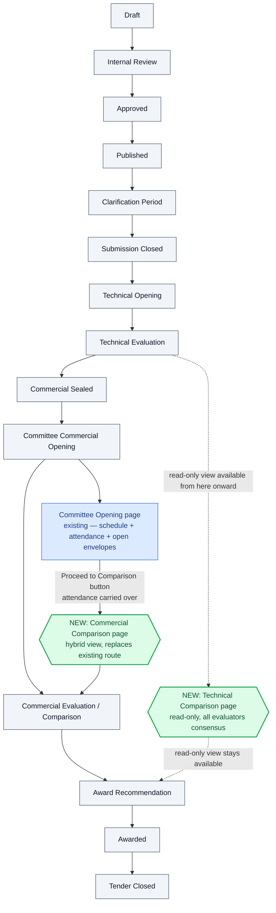
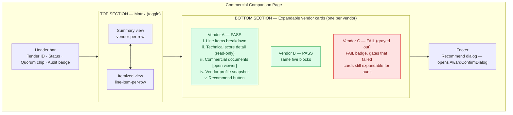
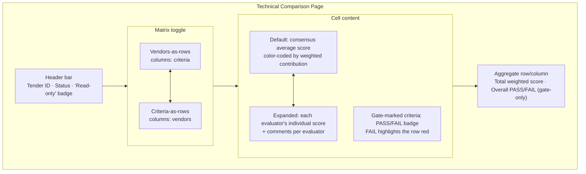
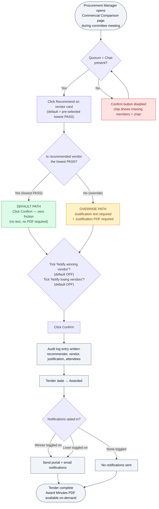
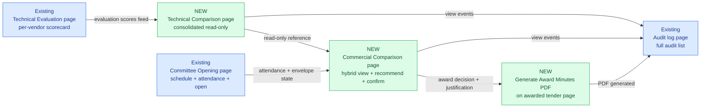

# In-App Comparison — Flowchart Reference

**Document type:** Visual locked reference
**Created:** 2026-05-27
**Companion to:** `IN_APP_COMPARISON_MASTER_PLAN_2026-05-27.md`

This document holds the **agreed visual model** for the in-app comparison redesign. Each diagram is a Mermaid flowchart that renders on GitHub, in VS Code with the Mermaid extension, and in Markdown previewers.

**Rule:** if a future implementation contradicts a diagram below, the diagram wins until the master plan is formally amended.

---

## Diagram 1 — Tender lifecycle showing the new pages



**No new lifecycle states.** The new pages slot into existing states — they are richer renderings, not state additions.

---

## Diagram 2 — Commercial Comparison page layout



**Pre-selection:** when the page loads, the **lowest commercial price among PASS vendors** is auto-highlighted in the matrix and pre-selected in the AwardConfirmDialog. Committee can override.

---

## Diagram 3 — Technical Comparison page layout



**Key reminder from C4:** Total weighted score is for **ranking** PASS vendors only — it never determines PASS/FAIL. PASS/FAIL is gate-only.

---

## Diagram 4 — Award decision flow (the Confirm sequence)



---

## Diagram 5 — PDF viewer flow (shared component)

```mermaid
flowchart LR
    Click[User clicks a document<br/>on Commercial Comparison<br/>or Technical Comparison<br/>or Technical Evaluation]

    Perm{Has<br/>'viewer:pdf:open'<br/>permission?}
    Auth{Authenticated<br/>session valid?}
    Fetch["GET /api/v1/bids/:id/envelopes/:type/documents/:docId/view<br/>(streams PDF inline)"]
    Audit[Backend writes<br/>document_view_log row]
    Modal[Open full-screen<br/>modal PDF viewer]
    Close[ESC key or Close button]
    DownloadCheck{Click Download?<br/>(if permission granted)}
    Download[Stream PDF as attachment<br/>+ audit log download event]

    Click --> Perm
    Perm -- No --> Deny[Show toast: insufficient permission]
    Perm -- Yes --> Auth
    Auth -- No --> Redirect[Redirect to login]
    Auth -- Yes --> Fetch
    Fetch --> Audit
    Audit --> Modal
    Modal --> DownloadCheck
    DownloadCheck -- No --> Close
    DownloadCheck -- Yes --> Download
    Download --> Modal

    classDef good fill:#dcfce7,stroke:#16a34a
    classDef bad fill:#fee2e2,stroke:#dc2626
    classDef neutral fill:#f1f5f9,stroke:#475569

    class Modal,Audit good
    class Deny,Redirect bad
    class Click,Fetch,DownloadCheck,Download,Close neutral
```

**Key:** the viewer modal cannot open until the audit log row is written. Failing-open on audit logging is not allowed.

---

## Diagram 6 — Amendment workflow

```mermaid
flowchart TD
    Awarded[Tender is in Awarded state]
    Discover["Mistake discovered:<br/>wrong vendor, withdrawal,<br/>calculation error, legal objection"]

    Privilege{User has<br/>'award:amend'?<br/>(default: Proc Mgr + Sys Admin)}
    Open[Open Amend Award form]
    Form["Form fields:<br/>- New recommended vendor<br/>- Mandatory reason (text)<br/>- Mandatory superseding PDF<br/>- Confirmation toggle"]
    Submit[Submit amendment]
    DBRecord["Create new row in awards table<br/>with superseded_by_award_id<br/>linking back to original"]
    AuditA[Audit log: 'Award amended'<br/>references old + new award IDs]
    UI["UI shows BOTH records<br/>Original (struck-through)<br/>+ Amendment (current)"]
    Visible["Both records visible<br/>in tender history forever"]
    NotifyAmend{Notify vendors<br/>about amendment?}
    NotifyEnd[Optional notifications fire]
    End([Amendment complete])

    Awarded --> Discover
    Discover --> Privilege
    Privilege -- No --> Deny[Show: insufficient permission]
    Privilege -- Yes --> Open
    Open --> Form
    Form --> Submit
    Submit --> DBRecord
    DBRecord --> AuditA
    AuditA --> UI
    UI --> Visible
    Visible --> NotifyAmend
    NotifyAmend -- Yes --> NotifyEnd
    NotifyAmend -- No --> End
    NotifyEnd --> End

    classDef neutral fill:#f1f5f9,stroke:#475569
    classDef warn fill:#fef3c7,stroke:#d97706
    classDef good fill:#dcfce7,stroke:#16a34a
    classDef bad fill:#fee2e2,stroke:#dc2626

    class Awarded,Discover,Open,Form,Submit,UI,Visible,End neutral
    class DBRecord,AuditA good
    class Privilege warn
    class Deny bad
```

**The original award is never deleted.** Both records remain in the database and visible in the UI. The amendment supersedes the original via the `superseded_by_award_id` foreign key.

---

## Diagram 7 — Cross-page data dependencies



---

## Reading order

Read these diagrams in this order to fully understand the system:

1. **Diagram 1** — where the new pages slot into the existing lifecycle (no new states).
2. **Diagram 7** — how the new pages and existing pages exchange data.
3. **Diagram 2** — what the Commercial Comparison page looks like.
4. **Diagram 3** — what the Technical Comparison page looks like.
5. **Diagram 4** — the actual decision flow when Procurement Manager + committee award a tender.
6. **Diagram 5** — how a single PDF gets viewed (used by both comparison pages + retest D2 fix).
7. **Diagram 6** — what happens when the committee makes a mistake.

---

## Change-control

This document is **locked** alongside the master plan. To amend:

1. Add a `## Amendment YYYY-MM-DD` heading at the bottom.
2. Describe what changed and why.
3. Update or replace the relevant diagram, keeping the old version above the new for traceability.
4. Update `MASTER_PLAN_2026-05-27.md` correspondingly.
5. Add a `DECISION_LOG.md` entry referencing both files.

No silent diagram edits.
