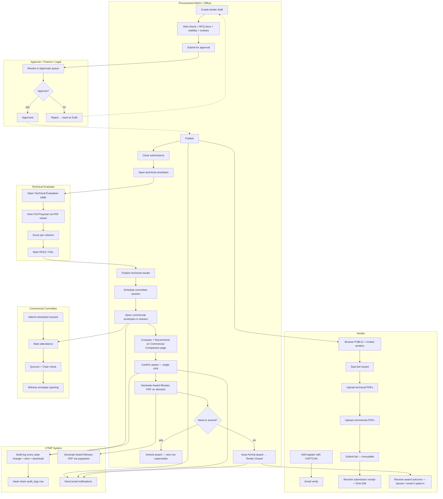
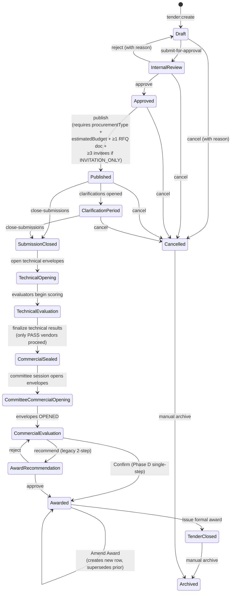
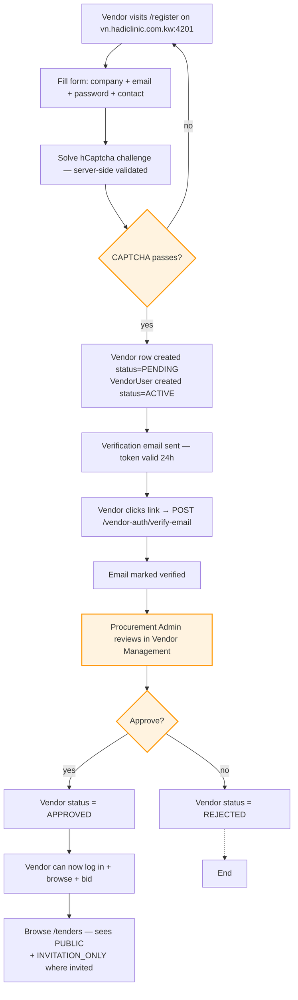
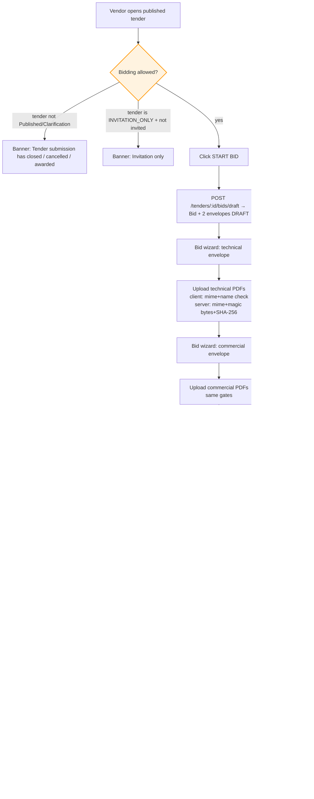
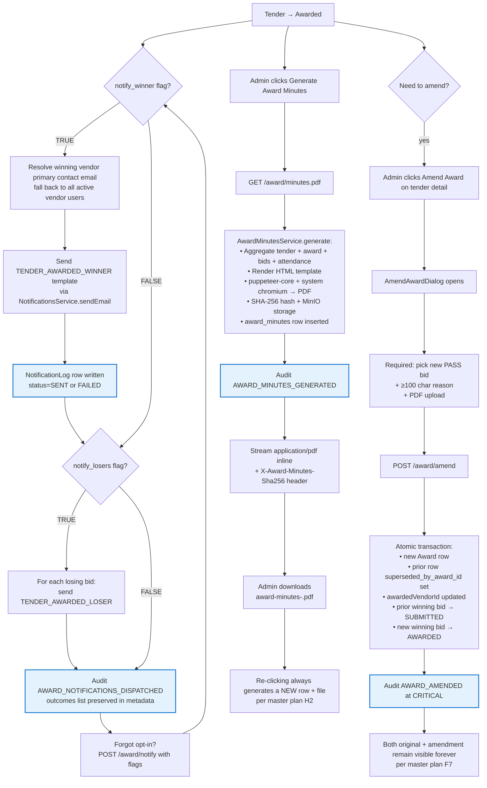
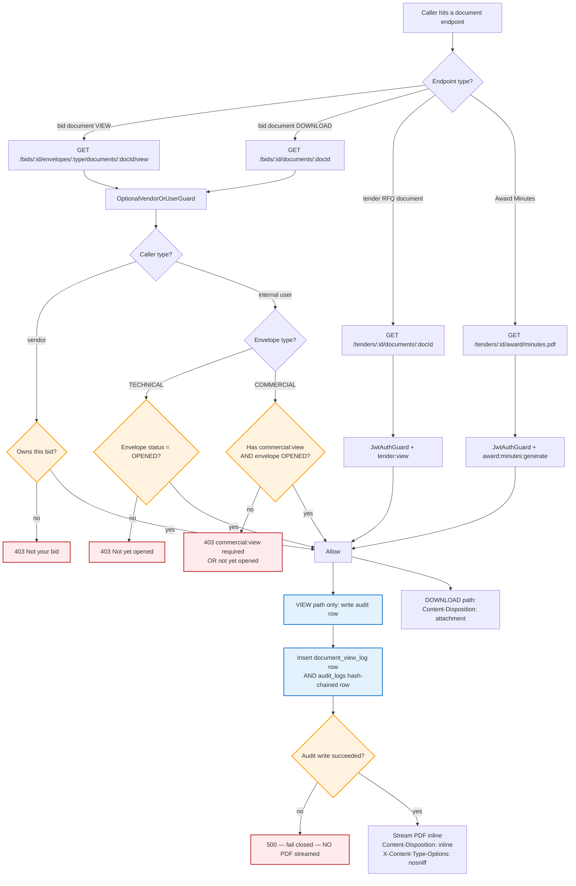

# CTMP — Complete Project Workflow

**Document type:** Reference workflow diagram pack
**Created:** 2026-05-28 (extends `IN_APP_COMPARISON_FLOWCHART_2026-05-27.md`)
**Audience:** Anyone onboarding to the project, owner sanity checks, security/compliance reviews

This document covers the **full project workflow end-to-end**, not just the in-app comparison redesign. For the redesign-specific diagrams (PDF viewer flow, Commercial Comparison page layout, etc.), see the 2026-05-27 flowchart — it remains the authoritative source for those slices.

The 10 diagrams below trace a tender from creation through closure, the actors who touch it, the permission gates that guard each surface, and the audit + notification side-effects of every state change.

---

## 1. Master swim-lane — the whole tender lifecycle in one picture



---

## 2. Tender state machine — all transitions



---

## 3. Vendor onboarding — registration → first bid



---

## 4. Tender creation → publication

```mermaid
flowchart TD
    T0[Admin clicks New Tender] --> T1[Fill basics:<br/>title + dept + submission deadline]
    T1 --> T2[Add optional:<br/>category + procurementType + KWD budget + visibility]
    T2 --> T3[Save as Draft]
    T3 --> T4[Tender detail page]
    T4 --> T5[Upload RFQ documents — PDF/Office, ≤50MB, server SHA-256]
    T5 --> T6{Visibility?}
    T6 -- PUBLIC --> T8[Configure technical criteria<br/>(library or custom, weights = 100%)]
    T6 -- INVITATION_ONLY --> T7[Manage Invited Vendors panel<br/>add ≥3 vendors]
    T7 --> T8
    T8 --> T9[Submit for Approval]
    T9 --> T10[Status: Internal Review]
    T10 --> T11[Approval workflow — Approver acts in Approvals queue]
    T11 --> T12{Approved?}
    T12 -- yes --> T13[Status: Approved]
    T12 -- no --> T14[Status: Draft with rejection reason]
    T13 --> T15[Admin clicks Publish]
    T15 --> T16{Pre-publish gates pass?<br/>• procurementType set<br/>• estimatedBudget set<br/>• ≥1 RFQ document<br/>• INVITATION_ONLY: ≥3 invitees}
    T16 -- no --> T17[400: missing fields enumerated]
    T17 -.-> T4
    T16 -- yes --> T18[Status: Published<br/>+ email vendors (deferred — BUG-016)]

    classDef gate fill:#fff3e0,stroke:#ff9800,stroke-width:2px
    class T6,T12,T16 gate
```

---

## 5. Bid submission — vendor side



---

## 6. Technical evaluation

```mermaid
flowchart TD
    TE0[Submission deadline passed] --> TE1[Admin: Open Technical Envelopes]
    TE1 --> TE2[Tender → Technical Opening<br/>technical envelopes → OPENED]
    TE2 --> TE3[Evaluator opens Technical Evaluation page]
    TE3 --> TE4[Pick tender + bid]
    TE4 --> TE5[Scorecard loads per-tender criteria<br/>via GET /tenders/:id/criteria]
    TE5 --> TE6[Click View Full Proposal]
    TE6 --> TE7[GET /bids/:id/envelopes/TECHNICAL/documents/:docId/view]
    TE7 --> TE8[Audit row written BEFORE stream — no failing-open]
    TE8 --> TE9[PDF streams into modal viewer]
    TE9 --> TE10[Evaluator scores per criterion<br/>+ toggles gate met / not met]
    TE10 --> TE11[Click Save Evaluation]
    TE11 --> TE12[TechnicalEvaluation row + per-criterion scores written]
    TE12 --> TE13[Repeat for every bid + every evaluator assigned]
    TE13 --> TE14[Admin: Finalize Technical Results]
    TE14 --> TE15[Server aggregates:<br/>• if ALL mandatory gates passed → PASS<br/>• else → FAIL<br/>(score is for ranking only — master plan §C4)]
    TE15 --> TE16[Tender → Commercial Sealed<br/>bid.technicalResult locked]

    classDef gate fill:#fff3e0,stroke:#ff9800,stroke-width:2px
    class TE15 gate

    classDef audit fill:#e3f2fd,stroke:#1976d2,stroke-width:2px
    class TE8 audit
```

---

## 7. Committee commercial opening + comparison + Confirm

```mermaid
flowchart TD
    CO0[Procurement Admin schedules committee session] --> CO1[Adds members + marks Chair]
    CO1 --> CO2[Session date arrives — physical meeting room]
    CO2 --> CO3[Procurement Admin opens Committee & Commercial page]
    CO3 --> CO4[Mark attendance per member: Present / Absent]
    CO4 --> CO5{Quorum + Chair present?<br/>• ≥ required_quorum_count members PRESENT<br/>• required_role_code member PRESENT}
    CO5 -- no --> CO6[QuorumStatus chip shows reason:<br/>'Need 2 more + Chair must be present'<br/>Confirm DISABLED downstream]
    CO5 -- yes --> CO7[Click Open Commercial Envelopes]
    CO7 --> CO8[Commercial envelopes → OPENED<br/>tender → Commercial Evaluation/Comparison]
    CO8 --> CO9[Navigate to /commercial-comparison]
    CO9 --> CO10[Matrix renders:<br/>• Lowest-PASS highlighted with Award icon<br/>• FAIL grayed but still expandable<br/>• Summary ↔ Itemized toggle]
    CO10 --> CO11[Expand vendor card — 5 blocks:<br/>1 line items 2 tech detail<br/>3 commercial docs 4 vendor profile<br/>5 Recommend button]
    CO11 --> CO12[Click Recommend on a vendor]
    CO12 --> CO13[AwardConfirmDialog opens]
    CO13 --> CO14{Lowest-PASS or override?}
    CO14 -- lowest-PASS --> CO15[Zero-friction Confirm<br/>no text no PDF required]
    CO14 -- override --> CO16[Required: ≥100 chars text<br/>+ PDF upload first<br/>POST /award/justification-document]
    CO16 --> CO17[Returns documentId valid 15 min]
    CO17 --> CO15
    CO15 --> CO18[Toggle vendor notification opt-ins<br/>(default OFF for both winner + losers)]
    CO18 --> CO19[Click Confirm]
    CO19 --> CO20{POST /award/confirm validates:<br/>• quorum still met<br/>• server recomputes lowestPassBidId<br/>• schema CHECK: override → text+PDF<br/>• bid technicalResult = PASS}
    CO20 -- fail --> CO21[400 with specific reason]
    CO21 -.-> CO13
    CO20 -- pass --> CO22[Atomic transaction:<br/>• Award row created<br/>• tender → Awarded<br/>• winning bid → AWARDED]
    CO22 --> CO23[Audit log AWARD_CONFIRMED at CRITICAL]
    CO22 --> CO24[Best-effort notification dispatch<br/>if opt-ins TRUE]

    classDef gate fill:#fff3e0,stroke:#ff9800,stroke-width:2px
    class CO5,CO14,CO20 gate

    classDef audit fill:#e3f2fd,stroke:#1976d2,stroke-width:2px
    class CO23 audit
```

---

## 8. Post-Confirm — notifications + Minutes + amendment



---

## 9. RBAC visibility — who can do what at each stage

```mermaid
flowchart LR
    subgraph Roles
        R1[SYSTEM_ADMIN]
        R2[PROCUREMENT_ADMIN]
        R3[PROCUREMENT_OFFICER]
        R4[APPROVER]
        R5[TECHNICAL_EVALUATOR]
        R6[COMMERCIAL_EVALUATOR]
        R7[COMMERCIAL_COMMITTEE_MEMBER]
        R8[AUDITOR]
        R9[VENDOR_ADMIN / VENDOR_USER]
    end

    subgraph Surfaces
        SUR1[Tender CRUD + Publish + Edit criteria]
        SUR2[Approvals queue]
        SUR3[Technical Evaluation page]
        SUR4[Technical Comparison page]
        SUR5[Committee & Commercial page]
        SUR6[Commercial Comparison page<br/>+ Recommend + Confirm]
        SUR7[Amend Award]
        SUR8[Generate Award Minutes]
        SUR9[Audit Log + Security Alerts]
        SUR10[Evaluation Criteria Library]
        SUR11[System Configuration]
        SUR12[Vendor portal: own bids only]
        SUR13[Commercial bid visibility<br/>(commercial:view / download)]
    end

    R1 --> SUR9
    R1 --> SUR10
    R1 --> SUR11
    R2 --> SUR1
    R2 --> SUR5
    R2 --> SUR6
    R2 --> SUR7
    R2 --> SUR8
    R2 --> SUR10
    R2 --> SUR4
    R3 --> SUR1
    R3 --> SUR4
    R4 --> SUR2
    R5 --> SUR3
    R5 --> SUR4
    R6 --> SUR4
    R6 --> SUR6
    R6 --> SUR13
    R7 --> SUR5
    R7 --> SUR6
    R7 --> SUR8
    R7 --> SUR4
    R7 --> SUR13
    R8 --> SUR4
    R8 --> SUR8
    R8 --> SUR9
    R9 --> SUR12

    %% Critical exclusion
    R1 -.X.- SUR13
    R1 -.X.- SUR6

    classDef critical fill:#ffebee,stroke:#c62828,stroke-width:2px
    class SUR13 critical
```

> **Critical exclusion:** `SYSTEM_ADMIN` does NOT receive `commercial:view` / `commercial:download` / `comparison:commercial:view` by default. This is a deliberate separation-of-duties rule enforced from migration 007 + reinforced by every subsequent migration. Master plan §I reaffirms.

---

## 10. Document access + audit gate (read-path security model)



---

## Cross-references

- **Locked design rules:** `IN_APP_COMPARISON_MASTER_PLAN_2026-05-27.md`
- **Redesign-specific diagrams:** `IN_APP_COMPARISON_FLOWCHART_2026-05-27.md`
- **Spec definitions:** `implementation-spec.md`
- **Lifecycle states (canonical):** CLAUDE.md "Domain Vocabulary"
- **Phase completion:** `IN_APP_COMPARISON_TRACKER_2026-05-27.md`
- **Recent code changes:** `agents/handoffs/HANDOVER.md`

End of project workflow pack.
