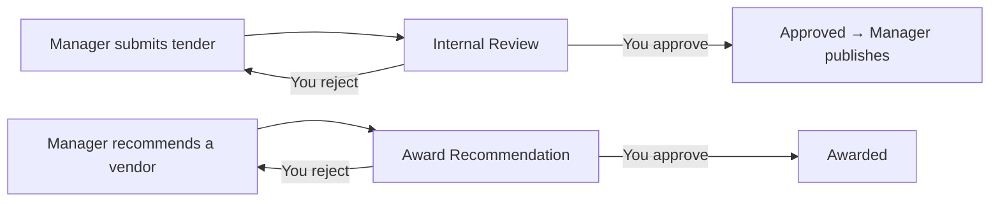

# Approver's Guide — Reviewing Tenders and Awards

**Audience:** Approver / Finance Reviewer / Legal Reviewer
**System:** HADICLINIC Tendering System — Admin Portal — **https://ctmp.hadiclinic.com.kw:4202**
**What this covers:** how to review and approve (or reject) the two things that need your sign-off — a **tender submitted for review** and an **award recommendation**.

> Save as PDF: open in a Markdown viewer → "Print → Save as PDF".

---

## When you're involved



You act at **two gates**: **Tender Approval** (status *Internal Review*) and **Award Approval** (status *Award Recommendation*).

---

## STEP 1 — Open the Approvals queue

Sign in → left menu → **Approvals**.

```
Approval Queue                                       [ Refresh ]
You have 3 tasks pending review.
[ Filter by ID or subject... ]  [ All Task Types ▾ ]  [ date ]

┌ Type ───────────── Task / Subject ──── Requested By ── Priority ── Actions ─┐
│ ⚖ Tender Approval   TND-2026-0007       A. Officer       HIGH      [Review]  │
│                     Supply of Equipment  Biomedical                          │
│ 🏆 Award Approval   TND-2026-0003       F. Manager       MEDIUM    [Review]  │
└─────────────────────────────────────────────────────────────────────────────┘
```
- **Type** tells you whether it's a **Tender Approval** or an **Award Approval**.
- Use the search / type filter to narrow the list. Click **Review** (or the row).

---

## STEP 2 — Review the details

The right panel shows everything you need:

```
Approval Details
  TND-2026-0007 · Supply of Medical Equipment            [ HIGH ]
  Requested By: A. Officer (Biomedical)     Request Date: 26 Jun 2026 11:00

  📄 Tender Description
     [ full description text … ]

  Related Documents
     RFQ_Scope.pdf            [ View ]  [ Download ]
     Drawings.pdf             [ View ]  [ Download ]

  💬 Your Comments *
     [ Enter your feedback or reason for rejection... ]
     Required for audit log and transparency.

        [ ✓ Confirm Approval ]      [ ✗ Reject Request ]
```

- Read the **Tender Description** and open the **Related Documents** (View for PDFs, Download for any file).
- For an **Award Approval**, you're confirming the recommended vendor — review the attached justification/minutes.

---

## STEP 3 — Approve or reject

1. **Type a comment** in *Your Comments* — this is **mandatory** for both approve and reject (it's recorded in the audit log). If you skip it: *"Comments are required for audit compliance."*
2. Click:
   - **Confirm Approval** — approves the task. The tender moves forward (**Internal Review → Approved**, or **Award Recommendation → Awarded**).
   - **Reject Request** — sends it back to the manager with your reason.
3. The task disappears from your queue once processed. Use **Refresh** to re-check.

---

## What happens next

| You approved a… | Result | Who acts next |
|---|---|---|
| **Tender** | Status → **Approved** | Manager clicks **Publish** |
| **Award** | Status → **Awarded** | Manager issues the award + minutes, then closes the tender |

---

## Notes

- You only see the **Approvals** item if you hold approval rights (`tender:approve` and/or `award:approve`).
- **Comments are always required** — they form the official record of your decision.
- You review; you don't edit the tender. If something needs fixing, **reject with a clear reason** so the manager can correct and resubmit.
- Every view, document open, and decision is **audit-logged**.

*Questions about a specific task? Contact the requesting officer/manager named under "Requested By".*
