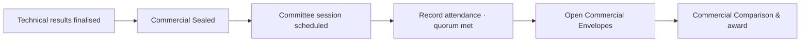

# Committee Member's Guide — Commercial Opening Session

**Audience:** Commercial Committee Member / Committee Chair
**System:** HADICLINIC Tendering System — Admin Portal — **https://ctmp.hadiclinic.com.kw:4202**
**What this covers:** the committee session where commercial (price) envelopes are formally opened — attendance, quorum, remarks, and the actual opening.

> Save as PDF: open in a Markdown viewer → "Print → Save as PDF".

---

## Where you fit in



Commercial prices are **sealed** until the committee opens them **in session** with a valid quorum. This is the control that guarantees prices are revealed fairly, together, on the record.

---

## STEP 1 — Open the session

Sign in → left menu → **Committee & Commercial** → select the tender ("Awaiting Commercial Opening").

```
Committee Commercial Opening — TND-2026-0007
📅 12 Jul 2026 10:00   👤 Chair: F. Manager   Quorum: 3 (CHAIR)   [ 🖨 Print Agenda ]
```
*(If no session exists yet, the Manager schedules one first — minimum 2 members.)*

---

## STEP 2 — Record attendance & quorum

```
Committee Attendance                    Opening Remarks
┌ Member ──── Role ── Present? ─┐        [ Enter session notes, formal
│ Member 1    CHAIR   [P] [A]   │          declarations, or observed
│ Member 2    PROC    [P] [A]   │          discrepancies… ]
│ Member 3    FIN     [P] [A]   │        (notes are time-stamped in the audit log)
└── Quorum met (3/3) ✓ ─────────┘
        [ 💾 Save ]
```
1. Mark each member **Present (P)** or **Absent (A)**.
2. The panel shows **Quorum met (X/Y) ✓** or a red **Quorum not met** warning.
3. Add **Opening Remarks** (formal declarations, any discrepancies observed). These are time-stamped in the audit log.
4. Click **Save**.

---

## STEP 3 — Open the commercial envelopes

On the right you'll see the **Technically Qualified Vendors** (those who PASSED technical), each with its sealed envelope and a checksum status (VERIFIED / PENDING).

```
Technically Qualified Vendors
┌ Vendor ─ Technical ─ Envelope ─ Checksum ─┐
│ Vendor A  PASS       🔒 sealed  ✓ VERIFIED │
│ Vendor B  PASS       🔒 sealed  ✓ VERIFIED │
└────────────────────────────────────────────┘

            [ 🔓 Open Commercial Envelopes ]
```
- The **Open Commercial Envelopes** button is the **only** way to unseal prices. It's disabled until:
  - the **scheduled meeting time** has arrived, **and**
  - **quorum** is met and **remarks** are saved.
- Click it. A green banner confirms: *"Envelopes opened — N commercial envelope(s) unsealed,"* with a link **Open in Commercial Comparison →**.

➡️ The tender moves to **Commercial Evaluation / Comparison**.

---

## What happens next

- The committee/finance evaluators (with commercial permission) review prices on the **Commercial Comparison** screen, where the lowest-price PASS vendor is highlighted and a recommendation is made.
- The recommendation then goes to the **Approver** for award approval.

---

## Notes

- **Quorum is mandatory** — the button stays locked until enough members are marked present and the meeting time has arrived.
- Everything is **audit-logged** — attendance, remarks, the opening action, and who did it.
- Seeing the actual prices requires the `commercial:view` permission; opening the envelopes (this step) and viewing prices are separate controls.
- Use **Print Agenda** for a paper record of the session.

*Questions on scheduling or membership? Contact the Procurement Manager who created the session.*
