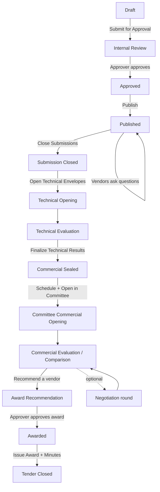

# Manager's Guide — Running a Tender from Creation to Close

**Audience:** Procurement Manager (Procurement Admin role)
**System:** HADICLINIC Tendering System — Admin Portal
**What this covers:** every step you take to run a tender, in order, with the exact buttons and screens you'll see.

> Tip: You can read this top-to-bottom the first time, then use the **Quick Reference** table at the end as a day-to-day cheat sheet. To share as PDF, open this file in any Markdown viewer and "Print → Save as PDF".

---

## 1. Before you start

- **Sign in** to the Admin Portal at **https://ctmp.hadiclinic.com.kw:4202** with your username and password (or your Active Directory account).
- You'll land on the **Dashboard**. The **left sidebar** is your main menu:

```
┌──────────────────────────┐
│  HADICLINIC TENDERING     │
├──────────────────────────┤
│  ▢ Dashboard              │
│  ▢ Tenders                │  ← create & manage tenders
│  ▢ Approvals              │
│  ▢ Clarifications         │
│  ▢ Technical Evaluation   │
│  ▢ Technical Comparison   │
│  ▢ Committee & Commercial │  ← open commercial envelopes
│  ▢ Commercial Comparison  │  ← compare prices & recommend
│  ▢ Awarded Tenders        │
│  ▢ Vendor Management       │
│  ▢ Reports                │
│  ▢ Audit Log              │
│  ▢ System Configuration   │
└──────────────────────────┘
```

- A tender always moves **forward through fixed stages**. You can always see the current stage as a coloured **status badge** on the tender.

---

## 2. The whole journey at a glance



**Who does what:**
- **You (Manager)** drive: create → set up → publish → close → open technical → finalize → schedule committee → open commercial → compare → recommend → issue award → close.
- **Approver** approves the tender (after you submit) and approves the award (after you recommend).
- **Technical Evaluators** score the technical envelopes (you open them and finalize).

---

## 3. Step-by-step

### STEP 1 — Create the tender

**Menu:** Tenders → **Create New Tender**

Fill in **Stage 1: Basic Information**:

```
┌────────────────────────────────────────────────────────────┐
│  Create New Tender                                          │
│  ① Basic Info  ② Technical  ③ Criteria  ④ Documents        │
├────────────────────────────────────────────────────────────┤
│  Tender Title *      [ Annual IT Infrastructure Upgrade ]   │
│  Reference Number    [ Auto-generated on save ]  (locked)   │
│  Department *        [ Select Department ▾ ]                 │
│  Category            [ Select Category ▾ ]                  │
│  Estimated Budget    [ KWD  100000 ]   (optional now)       │
│  Visibility          (•) Public   ( ) Invitation only       │
│  Supporting Docs     [ ] Require vendors to upload PDFs      │
│  Procurement Type    ( ) Open  ( ) Restricted  ( ) Single   │
│  Submission Deadline [ date ] [ time ]                       │
│  Clarification Deadline (optional) [ date ] [ time ]        │
│  Description         [ ............................. ]       │
│                                                            │
│              [ Cancel ]          [ 💾 Save as Draft ]        │
└────────────────────────────────────────────────────────────┘
```

- **Required:** Tender Title, Department, Submission Deadline. Everything else can be added before you Publish.
- **Category** options: Construction, IT Services, Healthcare, Engineering, Services, Insurance, Consulting, Supply.
- **Visibility** — *Public* (any approved vendor) or *Invitation only* (you pick vendors; needs at least **3 invited** before Publish). **This locks once saved.**
- Click **Save as Draft**. The tender is created and you're taken straight to the **Setup (Edit)** page.

➡️ Status becomes **Draft**.

---

### STEP 2 — Set up the tender (documents, criteria, BoQ)

You're now on the **Tender Setup** page (a green banner says *"Tender created — finish setup below"*). Scroll through and complete each block:

**a) Tender Documents** — the RFQ, scope of work, drawings, addenda.
```
Tender Documents                                   [ ⬆ Upload ]
┌── File ─────────────── Size ─── Uploaded ─── Actions ──┐
│  RFQ_Scope.pdf          240 KB   today        ⬇  🗑     │
└────────────────────────────────────────────────────────┘
Accepted: .pdf .doc .docx .xls .xlsx
```

**b) Technical evaluation criteria** — what the evaluators will score.
```
Technical evaluation criteria        3 criteria · weights 100 / 100 ✓
┌ Name ──── Code ── Description ── Max ── Weight ── Mandatory ── Role ─┐
│ Experience  EXP   ...            100     40        no        TECH    │
│ Methodology MTH   ...            100     35        no        TECH    │
│ Compliance  CMP   ...            100     25        yes(gate) TECH    │
└──────────────────────────────────────────────────────────────────────┘
        [ + Add from Library ]   [ + Add Custom ]      [ 💾 Save ]
```
> ⚠️ **Weights must total exactly 100** or you can't submit. The counter turns red if it's off.

**c) Bill of Quantities (BoQ)** — the priced line items vendors will fill in.
```
Bill of Quantities
┌ Item ── Description ─────────── Qty ── Unit ── ─┐
│  1      Core switches            10     pcs   🗑 │
│  2      Installation labour      1      lot   🗑 │
└───────────────────────────────────────────────── ┘
              [ + Add Line ]                   [ 💾 Save ]
```

**d) Invited vendors** (only if you chose *Invitation only*) — open the tender's **Manage Invited Vendors** panel and add at least 3.

Click **Save Changes** as you go. You can re-open Edit any time while the tender is in Draft/Internal Review/Approved.

---

### STEP 3 — Submit for approval

At the bottom of the Setup page (or from the tender's detail page), click:

```
Ready to submit?
Make sure Criteria weights total 100 and the BoQ lines are configured.
                                            [ ➤ Submit for Approval ]
```

➡️ Status becomes **Internal Review**. The tender now appears in the **Approver's** queue.

---

### STEP 4 — Approval (handed to the Approver)

The **Approver** opens **Approvals**, reviews, and either approves or rejects.
- **Approved** → status becomes **Approved** and the **Publish** button appears for you.
- **Rejected** → it returns to Draft with the reason; fix and re-submit.

*(If you also hold approval rights, you may see the Approvals queue too — but separation of duties usually means a different person approves.)*

---

### STEP 5 — Publish

**Menu:** Tenders → open the tender → top-right action:

```
   [ 🌐 Publish ]
```

➡️ Status becomes **Published**. Vendors can now see it (Public) or their invitation (Invitation only). Invitation emails/reminders go out from the **Manage Invited Vendors** panel.

---

### STEP 6 — Answer clarifications (while open)

**Menu:** the tender → **Clarifications** tab (or the sidebar **Clarifications**).

```
Clarifications                         [ + Ask vendor a question ]
┌─────────────────────────────────────────────────────────────┐
│ Vendor A · 12 Jun 10:30            [ UNANSWERED ]            │
│ "Can the deadline be extended?"                             │
│   ↳ [ Write a reply (private to the asking vendor)… ]       │
│                                    [ Post reply ]           │
└─────────────────────────────────────────────────────────────┘
```
- Replies are **private to the asking vendor**.
- Use **+ Ask vendor a question** to start a thread with a specific bidder.

---

### STEP 7 — Close submissions

When the deadline passes (or you decide to close), open the tender:

```
   [ Close Submissions ]      [ Revert ]
```
- **Close Submissions** → status **Submission Closed**.
- Need more time instead? Use **Extend Submission** (appears after closing) to set a new deadline.

---

### STEP 8 — Open the technical envelopes

On the tender (status *Submission Closed*):

```
   [ 📂 Open Technical Envelopes ]      [ 🔄 Extend Submission ]
```

➡️ Status becomes **Technical Opening**. The sealed technical envelopes are now available to evaluators. Commercial envelopes stay **sealed**.

---

### STEP 9 — Technical evaluation & finalize

**Menu:** **Technical Evaluation**.

> A banner reminds everyone: *"Commercial envelopes remain sealed. Do not reference commercial information at this stage."*

The evaluators score each bid against the criteria:
```
Technical Scorecard — Vendor A             [ 👁 View Full Proposal ]
┌ Criterion ───────── Max ── Score ── Met ─┐
│ Experience           100     85      ✓    │
│ Methodology          100     78      ✓    │
│ Compliance (gate)    100     90      ✓    │
└──────────────────────────────────────────┘
Current Score: 84 / 100      Requirement: Min. 70 to pass
Recommendation:  [ Fail ]  [ ✓ Pass ]
                              [ 💾 Save Evaluation ]
```

When **every** bid has been scored, finalize:
```
   [ 🔒 Finalize Technical Results ]
```
- If any bid is un-scored you'll see: *"Cannot finalize — un-evaluated: {vendor}."*
- ➡️ Status becomes **Commercial Sealed**. Only **PASSED** vendors continue to the commercial stage.

---

### STEP 10 — Schedule the committee session

**Menu:** **Committee & Commercial** → select the tender → **Schedule Committee Session**.

```
Schedule Committee Session
  Session Date    [ 12 Jul 2026 ]
  Session Time    [ 10:00 ]
  Required Quorum (members PRESENT)  [ 3 ]
  Required Role at Confirm           [ CHAIR ▾ ]
  Committee Members  [✓] Member 1  [✓] Member 2  [✓] Member 3
                              [ Cancel ]   [ Create Session ]
```
- Select **at least 2 members**. The quorum number is how many must be **present** when the award is confirmed.

➡️ A session is created (status **SCHEDULED**).

---

### STEP 11 — Open the commercial envelopes (in session)

On the meeting day, open the session, record attendance and remarks, then open the envelopes:

```
Committee Attendance              Opening Remarks
┌ Member ──── Role ── Present? ─┐  [ Session notes / declarations… ]
│ Member 1    CHAIR   [P][A]    │
│ Member 2    PROC    [P][A]    │  Technically Qualified Vendors
│ Member 3    FIN     [P][A]    │  ┌ Vendor ─ Tech ─ Envelope ─ Checksum ┐
└──── Quorum met (3/3) ✓ ──────┘  │ Vendor A  PASS   🔒 sealed  ✓ VERIFIED│
        [ 💾 Save ]               └───────────────────────────────────────┘

                                  [ 🔓 Open Commercial Envelopes ]
```
- The **Open Commercial Envelopes** button is the **only** way to unseal commercial prices. It needs **quorum** and **remarks**, and stays disabled until the scheduled meeting time.

➡️ Status becomes **Commercial Evaluation / Comparison**. A green banner offers **"Open in Commercial Comparison →"**.

---

### STEP 12 — Compare prices & recommend a vendor

**Menu:** **Commercial Comparison** → select the tender.

```
Commercial Comparison
Department · 4 bids · 3 PASS · 1 FAIL · 3 with price
┌ Vendor ─── Technical ─── Tech Score ─── Commercial Total ─── Status ─┐
│ Vendor A    PASS          84             KWD 92,500        ◀ lowest   │
│ Vendor C    PASS          80             KWD 95,000                   │
│ Vendor B    PASS          88             KWD 99,200                   │
└──────────────────────────────────────────────────────────────────────┘
```
- The **lowest-price PASS** vendor is highlighted automatically.
- Click a vendor to expand the technical breakdown + their **BoQ line prices**.
- Click **Recommend** on your chosen vendor. A dialog asks for a **written justification** (and a **PDF** if you override the lowest-price vendor) and checks quorum/role.

➡️ Status becomes **Award Recommendation**.

> 🔒 Commercial prices are sensitive — **every view and action here is audit-logged.**

*(Optional — Negotiation: instead of recommending, click **Negotiate** to invite PASS vendors to submit a revised price. You can run multiple rounds; original prices are always preserved. Then compare and recommend from the negotiated round.)*

---

### STEP 13 — Award approval (handed to the Approver)

Your recommendation goes to the **Approver** (Approvals queue). Once approved:

➡️ Status becomes **Awarded**.

---

### STEP 14 — Issue the award & generate minutes

Open the awarded tender. You'll see:

```
 [ 📄 Generate Award Minutes ]   [ ✏ Amend Award ]   [ ✓ Issue Award ]   [ 🔒 Close Tender ]
```
- **Generate Award Minutes** — downloads the official Award Minutes **PDF** (you can regenerate any time).
- **Amend Award** — if something must change, this supersedes the award with a new record.
- **Issue Award** — issues the formal award (confirmation dialog).
- Award-outcome emails go to the winning and non-winning vendors automatically.

---

### STEP 15 — Close the tender

Final step:

```
   [ 🔒 Close Tender ]
```

➡️ Status becomes **Tender Closed**. The process is complete. *(If you ever need to, **Reopen Tender** moves it back to Awarded.)*

---

## 3b. Inviting a supplier who is not on the platform yet

An *Invitation only* tender needs at least three **already-registered, approved** vendors before you
can publish. If the company you want is not on the platform at all, invite them to join the registry
first — this is separate from inviting a registered vendor to a tender, and it mentions no tender.

**Vendors → Invitations → Invite a supplier.** Two fields:

```
Invite a supplier
They receive an email explaining the portal and a link to register.
Registration still needs your approval before they can bid.

  Company name  [ ACME Trading Co.        ]
  Email address [ sales@acme.com          ]        [ Send invite ]

  The company name is used only in the email greeting.
  It does not create a vendor record.
```

Available to **Procurement Admin, Procurement Officer and System Admin**. If you cannot see the tab,
you were granted the permission after you signed in — log out and back in.

**What happens next.** They get one email with a personal link, register with their own documents and
password, verify their email, and then land in **Pending Approval** like any other applicant. You
approve them there as usual. **An invitation grants nothing** — it only saves them typing.

The Invitations list tracks each one:

| Status | Meaning | What you can do |
|---|---|---|
| **Pending** | Sent, not yet used | **Resend** (issues a new link and kills the old one) · **Revoke** |
| **Registered** | They signed up | **view vendor** → jumps to their record |
| **Expired** | 14 days passed | **Invite again** |
| **Revoked** | You withdrew it | — |

**Worth knowing**
- One live invitation per email address. To chase someone, use **Resend**, not a second invite.
- The link expires after **14 days**, and **Resend replaces it** — anyone still holding the old link
  will find it dead.
- Inviting an address that already has a supplier account is refused, and no email is sent.
- Revoked and long-expired invitations are cleared automatically each week. Registered ones are kept.
- Sending is rate-limited (a few per minute, 20 per person per day). For a large onboarding drive,
  tell IT rather than working around it.

---

## 4. Exceptions you can use any time

| You need to… | Button | Effect |
|---|---|---|
| Pause a tender (e.g. legal hold) | **Hold** | → Suspended; **Resume** brings it back |
| Cancel a tender | **Cancel Tender** | → Cancelled (needs a reason) |
| Send a published tender back to fix it | **Revert** | → back to Approved / Internal Review / Draft |
| Give vendors more time after closing | **Extend Submission** | re-opens with a new deadline |

---

## 5. Quick reference — what button appears when

| Status | Your next action(s) |
|---|---|
| **Draft** | Edit setup → **Submit for Approval** |
| **Internal Review** | *(wait for Approver)* |
| **Approved** | **Publish** |
| **Published** | Answer **Clarifications**; **Close Submissions** (or **Revert**) |
| **Submission Closed** | **Open Technical Envelopes** (or **Extend Submission**) |
| **Technical Opening / Technical Evaluation** | Evaluators score → **Finalize Technical Results** |
| **Commercial Sealed** | **Schedule Committee Session** |
| **Committee Commercial Opening** | Record attendance → **Open Commercial Envelopes** |
| **Commercial Evaluation / Comparison** | Compare → **Recommend** (or **Negotiate**) |
| **Award Recommendation** | *(wait for Approver to approve the award)* |
| **Awarded** | **Generate Award Minutes**, **Issue Award**, **Close Tender** (or **Amend Award**) |
| **Tender Closed** | Done *(or **Reopen Tender**)* |

---

## 6. Golden rules

1. **Criteria weights must total 100** before you can submit.
2. **Visibility, department and budget lock** at different points — set them right early (visibility locks on first save; department locks after Draft; budget locks after approval).
3. **Commercial prices stay sealed** until the committee opens them in session — never reference price during technical evaluation.
4. **Invitation-only** tenders need **≥3 invited vendors** before Publish.
5. **Everything is audit-logged** — views, edits, document opens, and award actions.
6. If a button you expect is missing, check the tender's **status** (actions are stage-specific) — and that you're signed in with your Manager role.

---

*Questions or a step not behaving as described? Contact the system administrator (IT). For the technical/admin side, see `docs/runbooks/PRODUCTION_OPERATIONS.md`.*
