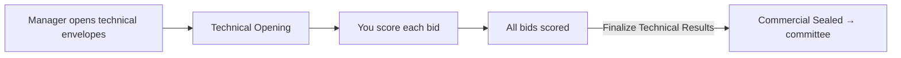

# Technical Evaluator's Guide — Scoring Bids

**Audience:** Technical Evaluator
**System:** HADICLINIC Tendering System — Admin Portal — **https://ctmp.hadiclinic.com.kw:4202**
**What this covers:** how to score each vendor's technical proposal against the published criteria, and how the results are finalised.

> Save as PDF: open in a Markdown viewer → "Print → Save as PDF".

---

## Where you fit in



You score only the **technical** side. **Commercial prices stay sealed** — you won't see them, and you must not ask for them.

---

## STEP 1 — Open the evaluation workspace

Sign in → left menu → **Technical Evaluation**.

> A banner reminds you: *"Commercial envelopes remain sealed. Do not request or reference commercial information at this stage."*

The screen has three columns:
```
Tenders Under Evaluation │ Submitted Bids        │ Technical Scorecard
 [ filter… ]             │  Vendor A  · PASS/—   │  (select a bid to score)
  TND-2026-0007  ▸       │  Vendor B  · pending  │
  TND-2026-0003          │  Vendor C  · pending  │
```
1. Pick a **tender** (left).
2. Pick a **bid / vendor** (middle).

---

## STEP 2 — Score one vendor

The right panel is the **Technical Scorecard — {vendor}**. Click **View Full Proposal** (eye icon) to read their PDF.

```
Technical Scorecard — Vendor A          [ 👁 View Full Proposal ]
Evaluating as: yourname    (Technical / Procurement portion)
┌ Technical Criterion ──────── Max ── Score ── Met ─┐
│ Experience                    100     85      ☑    │
│ Methodology                   100     78      ☑    │
│ Compliance (gate)             100     90      ☑    │
└───────────────────────────────────────────────────┘
Current Score: 84 / 100        Requirement: Min. 70 to pass
Recommendation:   [ Fail ]   [ ✓ Pass ]

Evaluator Notes (Internal Only)
  [ Provide detailed justification for the scores assigned above… ]
  * Notes visible to Tender Committee and Audit only. No vendor access.

                              [ 💾 Save Evaluation ]
```

For each criterion:
- Enter a **Score** (0 up to the **Max** shown).
- Tick **Met** if the bid meets that criterion (mandatory "gate" criteria must be met to pass).

Then:
- Set the **Recommendation** toggle to **Pass** or **Fail** (the running **Current Score** and the *Min. 70 to pass* threshold help you decide).
- Add **Evaluator Notes** — your written justification (internal only; vendors never see these).
- Click **Save Evaluation**.

Repeat for **every** vendor in the middle column.

---

## STEP 3 — Finalise the results

When all bids are scored, finalise (this may be done by you or the Manager, depending on your permissions):

```
Lock all scorecards for this tender. Only PASSED vendors proceed to commercial comparison.
                                            [ 🔒 Finalize Technical Results ]
```
- If a bid is still un-scored, you'll see: *"Cannot finalize — un-evaluated: {vendor}."* — finish those first.
- After finalising, the tender moves to **Commercial Sealed**. Only **PASS** vendors continue; commercial envelopes are opened later by the committee.

---

## Notes

- **Never reference price** during technical evaluation — commercial envelopes are sealed by design.
- Your scores and **Pass/Fail** decisions, and your notes, are **audit-logged** and visible to the committee and auditors.
- Past evaluations are **view-only** (a "View only" badge appears) once finalised.
- Use **View Full Proposal** to read the actual submitted technical PDF before scoring.

*Questions on criteria meaning? Ask the Procurement Manager who set up the tender.*
