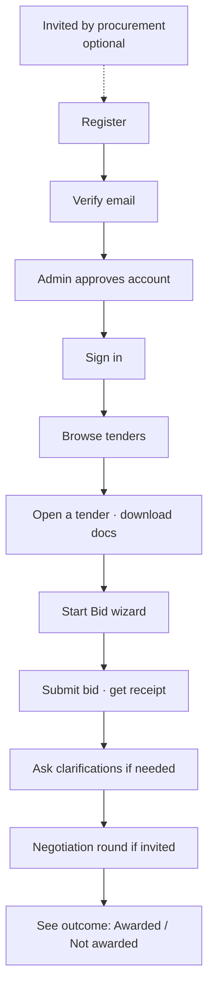

# Vendor's Guide — Registering and Bidding

**Audience:** Vendors (suppliers/contractors)
**System:** HADICLINIC Tendering System — Vendor Portal — **https://vn.hadiclinic.com.kw:4201**
**What this covers:** creating your account, finding tenders, submitting a bid, asking questions, negotiation, and seeing the result.

> To save as PDF: open this file in a Markdown viewer → "Print → Save as PDF".

---

## Your journey



**Top menu (after sign-in):** Dashboard · Tenders · My Bids · Clarifications · Profile.

---

## STEP 1 — Register your company

There are two ways to reach the registration form. Both end in the same place.

**If procurement invited you**, your email contains a **Register your company** button. Open it and
the form is already filled in with your company name and email address:

```
✓ You were invited to register. Your email address is filled in below.
                                     ( Use a different email address )
```

The email field is locked to the address the invitation was sent to, because that is what links
your registration back to the invitation. If your real contact address is different, click **Use a
different email address** — you can still register normally, it just will not be matched to the
invite.

> If the link says *"This invitation link is no longer valid"*, nothing is wrong on your side —
> the invite has expired or been withdrawn. **Carry on and register below anyway**, or ask
> procurement for a fresh one. The form works either way.

**Otherwise**, go to the portal → **Register as vendor**.

```
Register as a Vendor
Submit your company details. Registration is reviewed by procurement before activation.

COMPANY INFORMATION
  Company Name *        [ .................. ]
  Company Website       [ https://www.example.com ]
  Phone                 [ .................. ]
  Address               [ .................. ]

PRIMARY CONTACT
  Contact Full Name *   [ .................. ]
  Contact Phone         [ .................. ]
  Contact Email *       [ .................. ]
  Password *            [ .................. ]   (≥12 chars, mixed case + number + symbol)

REQUIRED DOCUMENTS   (PDF only, up to 10 MB each)
  Commercial License *   [ Upload PDF ]
  Authorisation Letter   [ Upload PDF ]   (optional)
  Other supporting docs  [ Upload PDF ]   (optional, up to 5)

VERIFY YOU ARE HUMAN
  [ hCaptcha ✔ ]

                 [ Cancel ]      [ Submit Registration ]
```

- **Required:** Company Name, Contact Full Name, Contact Email, Password, **Commercial License** (PDF), and the **CAPTCHA**.
- Click **Submit Registration**. You'll see *"Registration Submitted — Verification email sent to {your email}."*

---

## STEP 2 — Verify your email & wait for approval

1. Open the email from the Tendering System and click the verification link → *"Email Verified."*
2. An administrator then reviews and **approves** your account. You'll get a follow-up email once approved.
3. Until approved, your status shows **Pending** (you can sign in but bidding is limited).

*(Forgot your password later? Use **Forgot password?** on the sign-in page → enter email + CAPTCHA → check your inbox → **Set new password**.)*

---

## STEP 3 — Sign in

```
Welcome Back — Sign in to manage your bids.
  Email     [ you@company.com ]
  Password  [ •••••••• ]
                         [ Sign In ]
  Register as vendor   ·   Forgot password?
```
*(If you enabled MFA, enter the 6-digit code on the next screen and click **Verify**.)*

You land on the **Dashboard** — your active bids, open tenders, and counts (Active Bids, Open Tenders, In Evaluation, Awarded).

---

## STEP 4 — Find a tender

Menu → **Tenders** ("Public Tenders").

```
Public Tenders                              [ Search tenders... ]  [ All categories ▾ ]
┌─────────────────────────────────────────────────────────────┐
│  TND-2026-0007                              [ Published ]     │
│  Supply of Medical Equipment                                │
│  Biomedical Dept · Healthcare      Closes in: 12 days        │
│                                        [ VIEW DETAILS ]      │
└─────────────────────────────────────────────────────────────┘
```
Click **VIEW DETAILS** to open a tender.

---

## STEP 5 — Read the tender & download documents

On the tender page you'll see the **Description**, **Key Requirements**, **Tender Documents** (each with **View** / **Download**, or **Download All Documents**), and the **Submission Deadline** with a countdown.

When you're ready, on the right:
- **START BID** — begin a new bid.
- **CONTINUE BID** — resume a saved draft.
- **VIEW SUBMITTED BID** — if you already submitted.

> If bidding is blocked you'll see why (e.g. *"Submission window closed"*, *"Invitation only"*, *"Not yet open for bidding"*).

---

## STEP 6 — Complete the Bid Wizard

The wizard has these steps (a progress bar shows where you are):

**① Tender** — review the summary. Note: *"Submitted bids are immutable. Documents are SHA-256 checksummed at submit."* → **Continue →**

**② Technical Envelope** — upload your technical proposal PDFs. Each file shows its size + a SHA-256 checksum. *(These stay sealed until the technical opening phase.)* → **Continue →**

**③ Commercial Pricing — Bill of Quantities** — enter your **unit price (KWD)** for each line, or switch a line to **Not bidding**. The system multiplies unit price × quantity and gives a grand total.
```
Item  Description          Qty  Unit  Bidding?      Unit price   Line total
 1    Core switches        10   pcs   [Bidding ▾]   [ 250.000 ]   2,500.000
 2    Installation labour   1   lot   [Bidding ▾]   [ 900.000 ]     900.000
                                                Grand total (KWD)   3,400.000
   [ ⬇ Download CSV ]  [ ⬆ Import CSV ]     [ ← Back ]  [ Save draft ]  [ Continue → ]
```
> Prefer Excel? **Download CSV**, fill prices offline, **Import CSV**.

**Commercial Terms** — on the same step, below the pricing table. These are read alongside your
price when bids are compared, and they are printed in the Award Minutes, so fill them in properly.
```
COMMERCIAL TERMS
  Brand / Manufacturer  [ .................. ]
  Country of Origin     [ .................. ]
  Warranty (years)      [ 3 ▾ ]
  Delivery Period       [ From ] – [ To ]  [ Weeks ▾ ]     (To is optional)
  Payment Terms         [ 25% upon signing the contract              ]
                        [ 25% upon delivery and installation         ]
                        [ 50% after the Acceptance Certificate       ]
```
Every field is optional and none of them blocks submission — but a blank warranty or delivery
period is simply read as "not offered" when your bid is compared against others. If you are invited
to a negotiation round later, you can revise these along with your price.

**④ Commercial PDF** — upload your signed pricing PDF (**required**). Stays sealed until the committee opens commercial envelopes.

**⑤ Supporting Documents** (only if the tender requires them) — attach certificates/letters (PDF). **+ Add document**.

**⑥ Review & Submit** — check everything. *"By submitting you certify the contents are final."* → **Submit Bid**.

After submitting you get a **receipt**:
```
✔ Bid submitted successfully — Receipt is your proof of submission.
  Receipt Number   : RCPT-…
  Receipt Hash     : <SHA-256>
  Submitted At     : 26 Jun 2026 13:40
  Document Checksums: TECHNICAL / COMMERCIAL files + SHA-256
        [ View bid detail ]   [ Done ]
```
Keep this receipt — it proves what you submitted and when.

---

## STEP 7 — Ask clarifications (optional)

Menu → **Clarifications** → pick the tender → type your question → **Submit Question**.
- Procurement's replies are **private to your company**.
- If procurement asks YOU something, the thread shows **FROM PROCUREMENT** — reply with **Send reply**.

---

## STEP 8 — Negotiation round (only if invited)

If procurement invites you to revise your price, the Dashboard/My Bids show a 🤝 banner. Open the bid → **Negotiation Rounds**:
```
Round 2 — revise your commercial          [ Open ]
Reason: "Revised quantities for lines 4–7"
  (re-price the BoQ lines)              Round total (KWD)  …
  Commercial PDF *  [ Click to select a PDF ]
  Remarks (optional) [ ............... ]
                          [ Submit round 2 ]
```
- Your **original bid is preserved forever**; the negotiation submission is a new entry. There's no deadline, but submit promptly.

---

## STEP 9 — See the result

Menu → **My Bids** → open the bid. The bid status and a banner tell you the outcome:
- 🏆 **You have been awarded** — *"Congratulations… the procurement team will be in touch about contract execution."*
- 📄 **Awarded to another vendor** — *"Thank you for participating…"*

Bid statuses you may see: **Draft, Submitted, Evaluated, Awarded** (plus Late/Withdrawn/Disqualified). Technical result shows **PASS / FAIL / Pending**.

---

## Your account & profile

Menu → **Profile** — update company phone/website/address/tax number and primary contact name. Some fields are locked (Registration Number, Email — email changes need admin support). Your **Registration Status** (Pending / Approved / Suspended) shows at the top.

---

## Tips

- **PDF only**, up to 10 MB per file. Technical and commercial documents are checksummed (SHA-256) — keep your receipt.
- **Submitted bids can't be edited** — review carefully before submitting.
- Replies and prices are confidential; commercial prices stay sealed until the committee opens them.
- Missing a button you expect? Check the tender's **status** and that your account is **Approved**.

*Need help? Contact the procurement team via the Clarifications feature, or your HADICLINIC procurement contact.*
